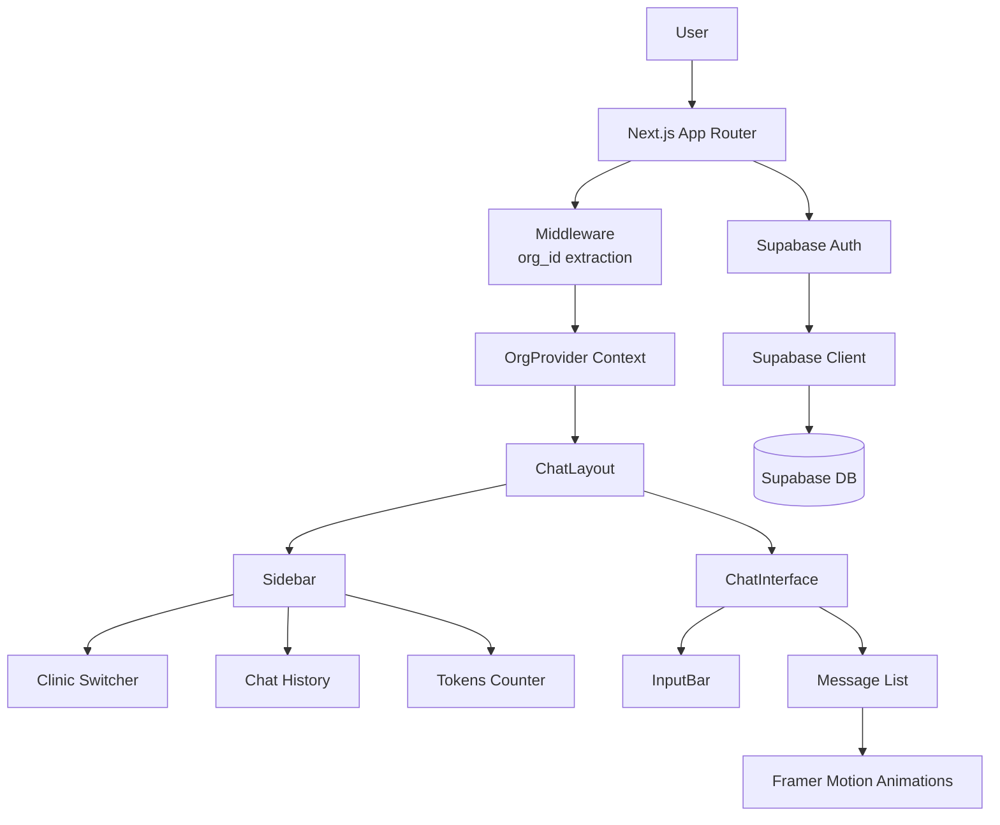

# DEETWIN Bot Core System Initialization Plan

## Overview
Initialize a Next.js 15 (App Router) application with TypeScript, Tailwind CSS, Supabase integration, and a custom "Grok-Black" UI theme. The system will support multi‑tenancy (multiple clinics) and feature a high‑end dashboard with a collapsible sidebar, chat interface, and floating input bar.

## Technology Stack
- **Framework**: Next.js 15 (App Router)
- **Language**: TypeScript
- **Styling**: Tailwind CSS
- **UI Components**: shadcn/ui (Button, Input, ScrollArea, Avatar, Card)
- **Animations**: Framer Motion
- **Backend / Auth**: Supabase (PostgreSQL, Auth, Realtime)
- **State / Context**: React Context (multi‑tenancy)

## Proposed File Structure
```
deetwinbot/
├── src/
│   ├── app/
│   │   ├── (auth)/
│   │   │   ├── login/
│   │   │   │   └── page.tsx
│   │   │   └── signup/
│   │   │       └── page.tsx
│   │   ├── (dashboard)/
│   │   │   ├── layout.tsx        # ChatLayout wrapper
│   │   │   ├── page.tsx          # Main chat interface
│   │   │   └── clinics/
│   │   │       └── [id]/
│   │   │           └── page.tsx
│   │   ├── embed/
│   │   │   └── [clinic_id]/
│   │   │       └── page.tsx      # Minimal embed iframe page
│   │   ├── layout.tsx            # Root layout (providers)
│   │   └── globals.css
│   ├── components/
│   │   ├── ui/                   # shadcn/ui components
│   │   ├── layout/
│   │   │   ├── ChatLayout.tsx
│   │   │   ├── Sidebar.tsx
│   │   │   ├── ChatInterface.tsx
│   │   │   └── InputBar.tsx
│   │   ├── chat/
│   │   │   └── widgets/          # Dynamic components (TikTok player, forms, etc.)
│   │   └── providers/
│   │       ├── SupabaseProvider.tsx
│   │       ├── OrgProvider.tsx   # Multi‑tenancy context
│   │       └── AIProvider.tsx    # Token management, tool status, clinic config
│   ├── lib/
│   │   ├── supabase/
│   │   │   └── client.ts
│   │   └── utils/
│   └── types/
├── public/
├── .env.local                    # Supabase environment variables
├── tailwind.config.ts
├── next.config.ts
└── package.json
```

## Architecture Diagram



## Multi‑Tenancy Approach
1. **Database**: Supabase `profiles` table includes `org_id` column linking users to clinics.
2. **Middleware**: On each request, extract the authenticated user’s `org_id` from the `profiles` table and inject it into a request header / context.
3. **React Context**: `OrgProvider` makes the current `org_id` available to all dashboard components.
4. **Clinic Switcher**: Admin users can switch between clinics (changes the context `org_id`).

## UI/UX Specifications
- **Background**: `#000000` (deep black)
- **Border**: `#1f2937` (very subtle gray)
- **Border Radius**: `rounded-2xl` (16px) for major containers
- **Sidebar**: Collapsible, dark theme, with:
  - Chat history (scrollable)
  - Tokens‑remaining counter
  - Clinic switcher (dropdown for admins)
- **Main Area**: Wide, centered chat interface with message bubbles.
- **Input Bar**: Floating‑style, fixed at bottom, with attachment icons (File, Image, Video).

## Implementation Steps

### Phase 1: Project Setup
1. Initialize Next.js 15 project with TypeScript, Tailwind CSS, App Router, and `src/` directory.
2. Install Supabase client (`@supabase/supabase-js`), configure environment variables (`.env.local`).
3. Initialize shadcn/ui and install required components (Button, Input, ScrollArea, Avatar, Card).
4. Install Framer Motion (`framer-motion`).

### Phase 2: Core Structure
5. Create `src/components/chat/widgets` folder and placeholder widgets (TikTok player, prescription form, etc.).
6. Implement `AIProvider` context for token management, tool status, and clinic‑specific configuration.
7. Create embed route `src/app/embed/[clinic_id]/page.tsx` (minimal iframe‑friendly page).
8. Create `ChatLayout` component that wraps the dashboard with sidebar and main area.
9. Implement Supabase Auth flow: login and sign‑up pages (using Supabase Auth UI or custom forms).
10. Set up `SupabaseProvider` and `OrgProvider` contexts.

### Phase 3: UI Components
11. Style all components with the Grok‑Black theme (background, borders, rounding).
12. Build sidebar with collapsible menu, chat history, tokens counter, and clinic switcher.
13. Build chat interface with message list and Framer Motion fade‑in animations.
14. Build floating input bar with attachment icons.

### Phase 4: Integration & Testing
15. Connect chat interface to Supabase Realtime for live messaging (optional).
16. Ensure responsive design across device sizes.
17. Verify multi‑tenancy: switching clinics changes the data scope.

## Dependencies to Install
- `next@latest`
- `react@latest` `react-dom@latest`
- `typescript` `@types/node` `@types/react` `@types/react-dom`
- `tailwindcss` `postcss` `autoprefixer`
- `@supabase/supabase-js`
- `@radix-ui/react-*` (via shadcn/ui)
- `framer-motion`
- `lucide-react` (for icons)

## Environment Variables
```bash
NEXT_PUBLIC_SUPABASE_URL=your_project_url
NEXT_PUBLIC_SUPABASE_ANON_KEY=your_anon_key
```

## Next Steps
1. Review and approve this plan.
2. Switch to **Code mode** to begin implementation.
3. Follow the todo list tracked in the architect mode.

## Open Questions / Decisions
- Should clinic switching be immediate (client‑side) or require a page refresh?
- Do we need real‑time chat (Supabase Realtime) in the first iteration?
- Any specific token‑counting logic (integration with external API)?

---

*Plan generated on 2026‑04‑19*