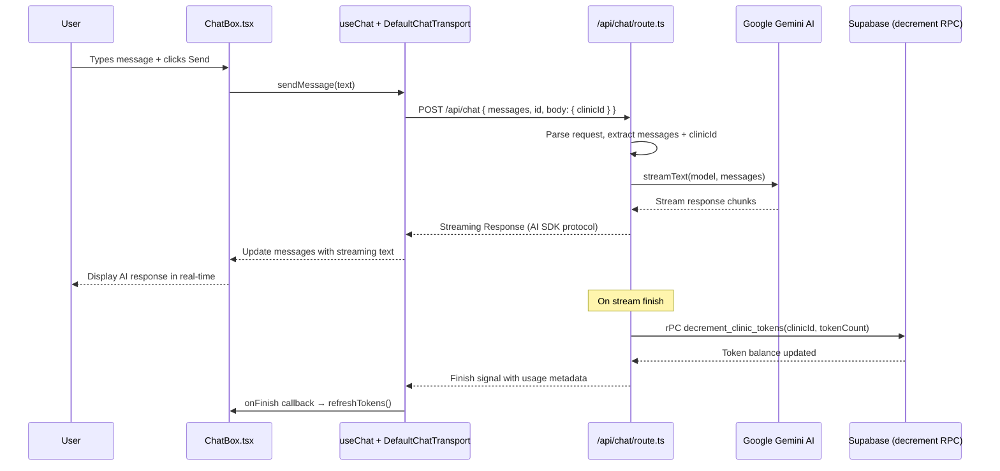

# Fix 404 Error — Bot Chat API Not Responding

## Diagnosis Summary

| # | Check | Status |
|---|-------|--------|
| 1 | `src/app/api/chat/route.ts` existence | ❌ **MISSING** — directory exists, file is gone |
| 2 | Route groups (auth)/(user) with nested API | ✅ API is directly under `src/app/api/` |
| 3 | ChatBox.tsx fetch URL | ✅ Uses `useChat` + `DefaultChatTransport` → defaults to `/api/chat` |
| 4 | `/user` or `/clinic` page.tsx | ❌ Routes don't exist (not the current 404 though) |
| 5 | Token deduction integration | ✅ `decrement_clinic_tokens` RPC exists in Supabase, needs wiring in API route |

### Root Cause

The file [`src/app/api/chat/route.ts`](../src/app/api/chat/route.ts) is **missing**. The empty directory `src/app/api/chat/` still exists, but Next.js requires a `route.ts` file to register the route handler. Without it, any POST to `/api/chat` returns a 404.

The [`ChatBox.tsx`](../src/components/chat/ChatBox.tsx:163) component uses `useChat` from `@ai-sdk/react` with `DefaultChatTransport`, which sends POST requests to `/api/chat` by default (see line 163-166):

```ts
const { messages, sendMessage, status, setMessages } = useChat({
    transport: new DefaultChatTransport({
        body: { id: clinicId },
    }),
    ...
```

## Plan

### Step 1: Create [`src/app/api/chat/route.ts`](../src/app/api/chat/route.ts)

Recreate the missing API route handler. This file must:

1. **Accept POST** requests from the `useChat` hook
2. **Parse the request body** — receives `{ messages, id }` plus the custom `body` data (`{ id: clinicId }`)
3. **Call Google Gemini** via [`@ai-sdk/google`](../package.json:12) (matching the pattern in [`ocr-extract/route.ts`](../src/app/api/ocr-extract/route.ts))
4. **Stream response** using AI SDK's `streamText` function (compatible with `useChat`)
5. **Deduct tokens** after response — call [`decrement_clinic_tokens`](../supabase/schema_update_v2.sql:52) RPC via the Supabase admin client ([`adminClient`](../src/lib/supabase/admin.ts))
6. **Return a streaming Response** following the AI SDK protocol

**Key implementation details:**

- Use `createGoogleGenerativeAI` from `@ai-sdk/google` with `GOOGLE_GENERATIVE_AI_API_KEY` env var
- Use `streamText` from `ai` package (v6) — this produces a streaming response compatible with `useChat`
- The request body from `useChat` + `DefaultChatTransport` includes:
  - `messages`: array of chat messages
  - `id`: conversation identifier string
  - `data`: any additional body data (here `{ id: clinicId }`)
- After streaming completes, extract token usage and call:
  ```ts
  await adminClient.rpc('decrement_clinic_tokens', {
      clinic_id: clinicId,
      amount: totalTokens
  })
  ```
- Use the `adminClient` (service role key) from [`src/lib/supabase/admin.ts`](../src/lib/supabase/admin.ts) to bypass RLS

### Step 2 (Optional): Create Placeholder Pages for `/user` and `/clinic`

If users navigate to `/user` or `/clinic`, create simple placeholder `page.tsx` files:

- [`src/app/user/page.tsx`](../src/app/user/page.tsx) — redirect to `/chat` or show a "User Dashboard" placeholder
- [`src/app/clinic/page.tsx`](../src/app/clinic/page.tsx) — redirect to `/` (dashboard) or show a "Clinic Dashboard" placeholder

These are optional — only needed if navigation exists pointing to these routes.

### Step 3: Verify

1. Start dev server: `npm run dev`
2. Open the chat page (e.g., `/chat` or `/`)
3. Send a message — should get a streaming AI response
4. Check console for no 404 errors on `/api/chat`
5. Verify tokens are deducted after response

## Flow Diagram



## Files to Create/Modify

| File | Action | Description |
|------|--------|-------------|
| [`src/app/api/chat/route.ts`](../src/app/api/chat/route.ts) | **Create** | Main chat API route handler with Gemini + token deduction |
| [`src/app/user/page.tsx`](../src/app/user/page.tsx) | Create (optional) | Placeholder for `/user` route if needed |
| [`src/app/clinic/page.tsx`](../src/app/clinic/page.tsx) | Create (optional) | Placeholder for `/clinic` route if needed |
